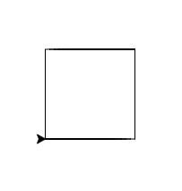
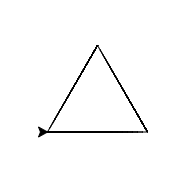
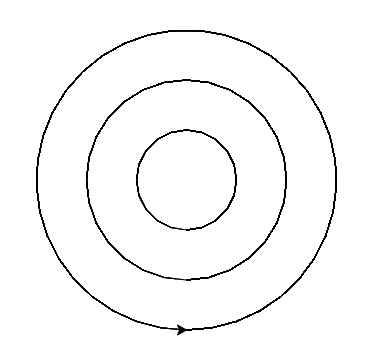
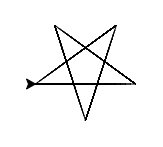

# PythonTurtle


“Turtle” is a Python feature like a drawing board, which lets us command a turtle to draw all over it! We can use functions like turtle.forward(…) and turtle.right(…) which can move the turtle around. Commonly used turtle methods are :

|Method	|Parameter	|Description|
|:-------------|:-------------|:-------------|
|Turtle()	|None	|Creates and returns a new turtle object|
|forward()	|amount	|Moves the turtle forward by the specified amount|
|backward()	|amount	|Moves the turtle backward by the specified amount|
|right()	|angle	|Turns the turtle clockwise|
|left()	|angle	|Turns the turtle counterclockwise|
|penup()	|None	|Picks up the turtle’s Pen|
|pendown()	|None	|Puts down the turtle’s Pen|
|up()	|None	|Picks up the turtle’s Pen|
|down()	|None	|Puts down the turtle’s Pen|
|color()	|Color name	|Changes the color of the turtle’s pen|
|fillcolor()	|Color name	|Changes the color of the turtle will use to fill a polygon|
|heading()	|None	|Returns the current heading|
|position()	|None	|Returns the current position|
|goto()	|x, y	|Move the turtle to position x,y|
|begin_fill()	|None	|Remember the starting point for a filled polygon|
|end_fill()	|None	|Close the polygon and fill with the current fill color|
|dot()	|None	|Leave the dot at the current position|
|stamp()	|None	|Leaves an impression of a turtle shape at the current location|
|shape()	|shapename	|Should be ‘arrow’, ‘classic’, ‘turtle’ or ‘circle’|

To make use of the turtle methods and functionalities, we need to import turtle.”turtle” comes packed with the standard Python package and need not be installed externally.
If you dont have a CodeEditor or IDE available this might be a good alternative: https://www.pythonsandbox.com/turtle
After importing the turtle library and making all the turtle functionalities available to us, we need to create a new drawing board(window) and a turtle. Let’s call the window as screen and the turtle as t. 
You dont need the window if you use the website.
So the code will look somthing like this:
```python
import turtle

screen = turtle.Screen()
screen.bgcolor("light green")
screen.title("Turtle")

t = turtle.Turtle()
t.speed(5)
```

Now you can use the Functions above to begin drawing.

---
Exercises:

**1. Draw a square** 


```python
import turtle

screen = turtle.Screen()
screen.bgcolor("light green")
screen.title("Turtle")

t = turtle.Turtle()
t.speed(5)

for i in range(4):
  t.fd(100)
  t.left(90)
```
---
**2. Draw an equilateral triangle**


```python
import turtle

screen = turtle.Screen()
screen.bgcolor("light green")
screen.title("Turtle")

t = turtle.Turtle()
t.speed(5)

for i in range(3):
  t.fd(100)
  t.left(120)
```
---
**3. Draw three concentric circles**


```python
import turtle

screen = turtle.Screen()
screen.bgcolor("light green")
screen.title("Turtle")

t = turtle.Turtle()
t.speed(5)

def pos():
  t.penup()
  t.right(90)
  t.fd(50)
  t.left(90)
  t.pendown()

for i in range(3):
  t.circle(50 * i)
  pos()
```

---
**4. Draw a spiral**

---
**5. Draw a star**


```python
import turtle

screen = turtle.Screen()
screen.bgcolor("light green")
screen.title("Turtle")

t = turtle.Turtle()
t.speed(5)

for i in range(4):
  t.fd(100)
  t.left(90)
```

